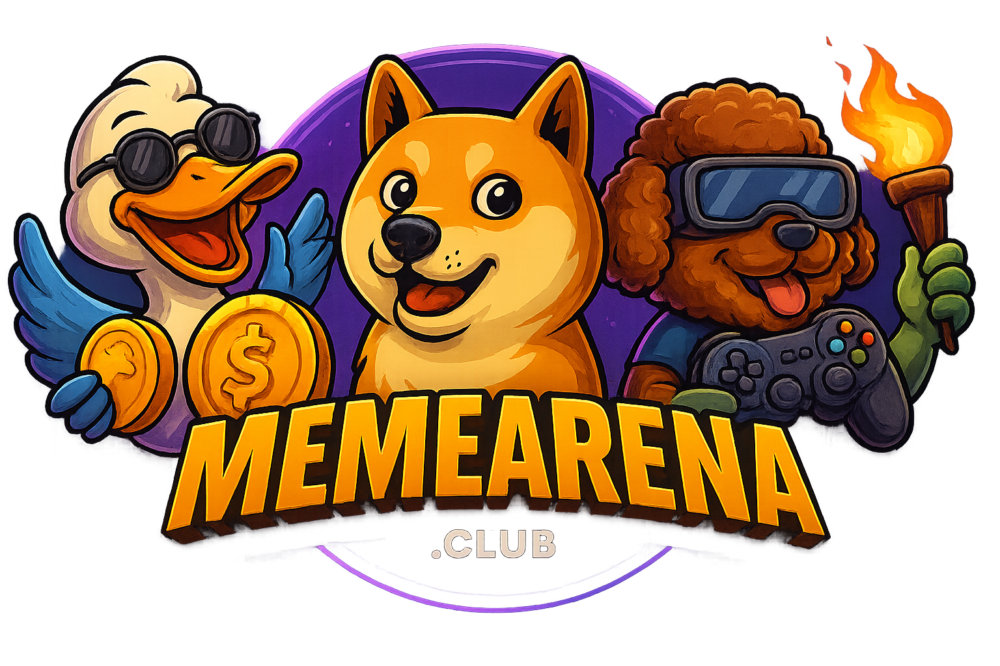

# Meme Battle Arena - Professional Web3 Gaming Platform



## 🎯 Project Overview

**Meme Battle Arena** is a cutting-edge decentralized gaming platform built on Binance Smart Chain that enables users to create token battles where community members stake their favorite meme tokens. The platform operates on a winner-takes-all principle with automatic NFT rewards for participants.

**Live Platform:** [memearena.club](https://memearena.club)  
**Blockchain:** Binance Smart Chain (BSC)  
**Contract Address:** `0x51Fe2C3Fba638f79BBFb5dc74640b7449Bb77722`

---

## 🏗️ Technical Architecture

### Frontend Technology Stack
- **Framework:** React 18 with TypeScript and Vite
- **Styling:** Tailwind CSS with shadcn/ui component library
- **Web3 Integration:** RainbowKit + Wagmi + Viem for wallet connectivity
- **State Management:** TanStack React Query for server state
- **Routing:** Wouter for client-side navigation
- **Form Handling:** React Hook Form with Zod validation

### Blockchain Infrastructure
- **Smart Contracts:** Solidity with OpenZeppelin security patterns
- **Network:** Binance Smart Chain (Mainnet)
- **Token Support:** 15+ whitelisted meme tokens (DOGE, SHIB, PEPE, FLOKI, BONK, etc.)
- **Safety Features:** ReentrancyGuard, Pausable, Ownable patterns
- **NFT Rewards:** ERC-721 with rarity-based minting system

### Backend & Services
- **Server:** Node.js with Express
- **Database:** Serverless PostgreSQL (Neon)
- **ORM:** Drizzle with type-safe migrations
- **Telegram Bot:** Real-time notifications and community engagement
- **API Integration:** CoinGecko for live token pricing

---

## 🚀 Key Features & Innovation

### 1. Advanced Battle System
- **Winner-Takes-All Mechanism:** Losing tokens redistributed proportionally to winners
- **USD-Based Calculations:** Real-time token pricing for fair winner determination
- **Multi-Duration Support:** 5 minutes to 6 months battle duration options
- **Automatic Finalization:** Smart contract handles battle conclusions

### 2. Professional UI/UX Design
- **Mobile-First Responsive:** Optimized for all devices
- **Dark Theme Only:** Professional gaming aesthetic
- **3D Hover Effects:** Enhanced user interaction
- **Hero Video Backgrounds:** Immersive visual experience
- **Professional Typography:** Corporate-grade design system

### 3. Web3 Integration Excellence
- **Multi-Wallet Support:** MetaMask, WalletConnect, Coinbase Wallet
- **Automatic Network Switching:** Seamless BSC connection
- **Token Balance Display:** Real-time balance checking
- **Transaction Status Tracking:** Comprehensive user feedback
- **Error Handling:** Robust Web3 error management

### 4. NFT Reward System
- **Automatic Minting:** NFTs awarded to battle winners
- **6-Tier Rarity System:** Common to Victory Champion levels
- **Professional Design:** High-quality 800x1200 PNG artwork
- **Metadata Integration:** Full BSCScan compatibility
- **Collection Showcase:** Dedicated NFT gallery

### 5. Community Engagement
- **Telegram Bot Integration:** Real-time battle notifications
- **Social Media Presence:** Twitter, Medium, Discord communities
- **Leaderboard System:** Competitive rankings and statistics
- **Battle History:** Comprehensive user portfolio tracking

---

## 🔧 Technical Highlights

### Smart Contract Security
```solidity
// Trustless architecture - no emergency withdrawal functions
// Winner-takes-all with automatic token distribution
// NFT rewards minted directly to winners
// Gas-optimized for BSC network
```

### Advanced Web3 Integration
```typescript
// Modern Wagmi hooks for contract interaction
// Automatic token decimal handling for 15+ tokens
// Real-time USD value calculations
// Multi-RPC failover system
```

### Professional Frontend Architecture
```typescript
// Type-safe React components
// Centralized token configuration
// Advanced error boundaries
// Performance optimized rendering
```

---

## 📊 Platform Statistics

- **Total Battles Created:** 16+
- **Supported Tokens:** 15 meme tokens
- **Active Warriors:** 19+ participants
- **Total Volume:** $474.9K+
- **Rewards Distributed:** $316.6K+
- **NFTs Minted:** Automatic for all winners

---

## 🎮 User Experience Flow

1. **Wallet Connection:** One-click MetaMask integration
2. **Battle Creation:** Select tokens, duration, and stake amount (0.01 BNB fee)
3. **Community Staking:** Users choose sides and stake tokens (0.001 BNB fee)
4. **Automatic Resolution:** Smart contract determines winner based on USD values
5. **Reward Distribution:** Winners receive original stakes + proportional losing tokens
6. **NFT Collection:** Automatic NFT minting for battle participants

---

## 🛡️ Security Features

- **No Admin Keys:** Trustless smart contract architecture
- **No Emergency Withdrawals:** User funds completely secure
- **ReentrancyGuard:** Protection against reentrancy attacks
- **Input Validation:** Comprehensive parameter checking
- **Rate Limiting:** API protection and spam prevention

---

## 🌐 Deployment & Infrastructure

- **Frontend Hosting:** Replit Web Service deployment
- **Smart Contract:** Verified on BSCScan
- **Database:** Neon PostgreSQL with connection pooling
- **CDN Integration:** Optimized asset delivery
- **SSL/TLS:** Full HTTPS encryption

---

## 📈 Performance Optimizations

- **Code Splitting:** Optimized bundle sizes
- **Image Optimization:** WebP and progressive loading
- **Caching Strategy:** Intelligent query caching
- **Mobile Performance:** Separate rendering paths for mobile/desktop
- **RPC Optimization:** Multiple BSC endpoints with failover

---

## 🎯 Business Impact

**Innovation:** First-of-its-kind meme token battle platform combining DeFi gaming with NFT rewards

**Community Building:** Active Telegram community with AI-powered bot engagement

**Technical Excellence:** Modern Web3 architecture serving as blueprint for future dApps

**Market Position:** Leading platform in meme token gaming sector

---

## 🔗 Links & Resources

- **Live Platform:** [memearena.club](https://memearena.club)
- **Smart Contract:** [BSCScan](https://bscscan.com/address/0x51Fe2C3Fba638f79BBFb5dc74640b7449Bb77722)
- **Documentation:** [Platform Docs](https://memearena.club/docs)
- **Twitter:** [@MemeArenaClub](https://x.com/MemeArenaClub)
- **Telegram:** [Community Chat](https://t.me/memearenaclub)

---

## 🏆 Technical Achievements

✅ **Zero-Downtime Deployment:** Always-on infrastructure  
✅ **Multi-Token Support:** 15+ tokens with different decimal systems  
✅ **Real-Time Pricing:** Live CoinGecko API integration  
✅ **Mobile Optimization:** Professional mobile experience  
✅ **Security Audit Ready:** Clean, auditable smart contract code  
✅ **Scalable Architecture:** Ready for mass adoption  

---

*Built with passion for Web3 innovation and community-driven gaming experiences.*